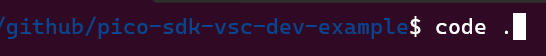

# pico-sdk-vsc-dev-example
Trivial example project using pico-sdk-vsc-dev

## clone:
> git clone --recurse-submodules https://github.com/jviskari/pico-sdk-vsc-dev-example

## Getting started.

### Windows 11 
- install WSL2
- install Docker Desktop For Windows
- Install Visual Studio Code (Windows)

### Linux 
- Install Visual Studio Code

### VS Code extensions
- Install WSL and Dev Containers extensions (ctrl+shift+x)

  

## Starting VS Code
- change directory to pico-sdk-vsc-dev-example
- start Visual Studio Code from shell

  

- select "Reopen in container" when prompted to do so.

  

  On the first time, it will take some time to build development container. This depends very much on the speed of the internet connection.

  When VSCode has completed the processing, open new terminal and run the build.sh to build uf2 image of the sample project

  
  

